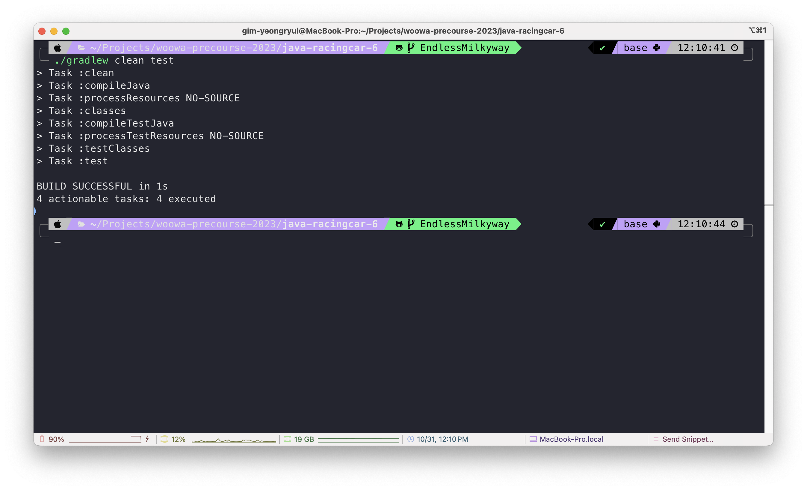

## 기능 목록
- 입력
	
	- [x] 사용자에게 경주에 자동차 참가할 자동차 이름을 입력받는다.
	  - [x] 자동차의 대수는 제한이 없다. (n개)
	  - [x] 자동차의 이름은 5자 이하만 가능하다.
	  - [x] 자동차 이름은 쉼표를 기준으로 구분한다.
	
	- [x] 사용자에게 시도할 회수(차수)를 입력받는다.
	
- 출력

  - [x] 자동차 이름 입력 안내 메시지
		```
		경주할 자동차 이름을 입력하세요.(이름은 쉼표(,) 기준으로 구분)
		```
	
	- [x] 시도할 횟수(차수) 입력 안내 메시지
	
	  ```
	  시도할 횟수는 몇회인가요?
	  ```
	- [x] 각 차수별 실행 결과
	
	  ```
	  실행 결과
	  (자동차 이름) : (진행률)
	  (자동차 이름) : (진행률)
	  (자동차 이름) : (진행률)
	  
	  ...
	  ```
	
	  위와 같은 형식으로 각 자동차에 대한 진행률을 출력
	
	- [x] 우승자 안내 문구 - 우승자는 한 명 이상일수 있다.
	
	  ```
	  최종 우승자 : 우승자1, 우승자2
	  ```
	
- 입력값 검증

  - [x] 자동차
	  - [x] 사용자가 올바른 형식으로 자동차들의 이름을 입력했는가?
	  - [x] 사용자가 입력한 이름 중 5자리를 넘는 이름이 존재하는가?
	  - [x] 사용자가 값을 입력하지 않았는가?
	- [x] 시도할 횟수
	  - [x] 숫자 이외에 다른 값이 들어왔는가?
	  - [x] 사용자가 값을 입력하지 않았는가?
	
- 자동차의 위치 관리

  - [x] 자동차의 상태를 나타내고 관리하는 도메인
	
- 자동차들의 상태 관리

  - [x] Car객체를 가지는 List를 가지고 있는 일급 컬렉션
	
- 게임 진행

  - [x] 차수별로 각각의 자동차에 대해 0에서 9 사이의 난수를 생성한 후 그것이 **4 이상**일 경우 그 자동차는 전진, 그렇지 않은 자동차는 위치 변화 X
  - [x] 차수가 모두 끝난 후 선두에 있는 자동차들을 구하는 기능, 선두는 1명 이상일 수도 있다.

## 개발 현황

1. String형의 이름과 int형의 현재 위치를 가지는 Car 도메인을 생성
   1. updatePosition 메서드: 자동차가 전진할 경우 위치를 업데이트할 때 사용하는 메서드이다.
   2. ~~isCarPassTheGoal 메서드: 해당 자동차 객체가 골인지점을 통과했는지 확인할 때 사용하는 메서드이다.~~
   3. ~~printCarName 메서드: 자동차의 이름을 출력할 때 사용하는 메서드이다.~~
2. 요구사항을 제대로 읽지 못해서 5라운드가 진행되면 5번 전진을 해야 우승이라고 생각하였다. 하지만 요구사항에는 어디에도 라운드 수 만큼 전진을 해야 우승이라고 작성되어 있지 않았다. 이에 따라 isCarPassTheGoal 메서드를 삭제하였다.
3. Car 클래스의 name에 대한 getter를 생성함에 따라 printCarName 메서드를 삭제하였다.
4. Car 클래스에 차량의 진행률을 반환하는 process 메서드를 생성하였다.
5. Car 객체를 가지는 List 내에서 position을 기준으로 정렬을 위해 Comparable 인터페이스를 구현하였다.
6. 기능 목록에 있는 출력 부분을 구현하였다. 목록은 아래와 같다.
   - 자동차 이름 입력 안내 메시지: inputNamesMsg
   - 시도할 횟수 입력 안내 메시지: inputRoundMsg
   - 실행 결과 제목: resultTitleMsg
   - 각 차수별 실행 결과: carResultMsg
   - 최종 우승자: finalWinnerMsg
7. View 클래스 내부에 공백 라인을 출력하는 printEmptyLine 메서드를 추가하였다.
8. Car 도메인의 유효성을 검증하기 위해 테스트 케이스를 생성 후 통과하였다.
9. Car 객체로 구성된 List를 가지고 있는 일급 컬렉션 Cars 클래스를 구현하였다.
10. Console API를 이용해 자동차 이름과 차수를 입력받는 기능을 구현하였다.
11. InputValidator 클래스 내부에 자동차 이름에 대한 입력값 검증 기능을 구현하였다.
12. 자동차 이름을 아무 것도 입력하지 않을 때 리스트의 첫 번째 요소의 이름을 확인해야 했다.
    이 때, (.)이 한 줄에 두 개 이상 사용되었고 이를 방지하고자 Cars 클래스 내부에 리스트의 첫번째 요소를 반환하는 별도의 메서드를 생성하였다.
13. 자동차 이름의 길이가 5를 초과하는지 확인하기 위해 Car 클래스 내부에 매개변수로 주어진 수와 Car 객체 내부 name의 길이를 비교한 후 boolean형을 반환하는 메서드를 구현하였다.
14. InputValidator 클래스 내부에 차수에 대한 입력값 검증 기능을 구현하였다.
15. Cars 클래스 내부에 Randoms API를 이용해 난수를 생성한 후 4 이상이면 자동차를 전진시키는 기능을 구현하였다.
16. Car 클래스 내부에 두 명 이상의 우승자를 확인하기 위해 매개변수로 주어진 Car 객체와 position을 비교하여 boolean형을 반환하는 메서드를 구현하였다.
17. Cars 클래스 내부에 Car형 List에서 positon 값이 가장 큰 요소를 구한 후 해당 요소와 position 값이 같은 요소들의 이름을 String형 List로 반환하는 메서드를 구현하였다.
18. View 클래스 내부에 있는 승자 목록을 출력하는 메서드를 구현하였다.
19. 자동차 경주의 전체 흐름을 담당하는 컨트롤러를 구현하였다.

## 테스트 케이스

### 목록

##### - DomainTest

- Car 객체 생성 테스트
  - Car 객체의 유효성을 검증하기 위해 테스트 케이스를 작성 후 통과하였다.
- Cars 객체 생성 테스트
  - Car 객체의 유효성을 검증하기 위해 테스트 케이스를 작성 후 통과하였다.

##### - GameProcessTest

- 난수가 4이상일 경우 자동차 위치 업데이트 O
  - Randoms API를 통해 생성된 난수가 4이상일 경우 자동차 위치 업데이트가 정상적으로 이루어지는지 확인하기 위해 테스트 케이스 작성 후 통과하였다.
- 난수가 4미만일 경우 자동차 위치 업데이트 X
  - Randoms API를 통해 생성된 난수가 4미만일 경우 자동차 위치가 업데이트 되지 않는지 확인하기 위해 테스트 케이스 작성 후 통과하였다.
- 게임 진행 후 선두의 자동차들을 계산
  - Cars 객체 내부에서 게임이 진행된 후 선두 그룹의 자동차들을 구하는 기능이 작동하는지 확인하기 위해 테스트 케이스 작성 후 통과하였다.

##### - InputTest

- 자동차 이름을 정상적으로 입력한 경우
  - 사용자가 자동차 이름을 정상적으로 입력한 경우 예외가 발생되지 않는지 확인하기 위해 테스트 케이스 작성 후 통과하였다.
- 자동차 이름을 5자리 이상 입력한 경우
  - 사용자가 자동차 이름을 5자리 이상 입력한 경우 예외가 발생되는지 확인하기 위해 테스트 케이스 작성 후 통과하였다.
- 자동차 이름을 입력하지 않은 경우
  - 사용자가 자동차 이름을 입력하지 않은 경우 예외가 발생되는지 확인하기 위해 테스트 케이스 작성 후 통과하였다.
- 차수를 정상적으로 입력한 경우
  - 사용자가 차수를 정상적으로 입력한 경우 예외가 발생되지 않는지 확인하기 위해 테스트 케이스 작성 후 통과하였다.
- 차수를 입력하지 않은 경우
  - 사용자가 차수를 입력하지 않은 경우 예외가 발생되는지 확인하기 위해 테스트 케이스 작성 후 통과하였다.
- 차수를 입력할 때 숫자가 아닌 다른 문자를 입력한 경우
  - 사용자가 차수를 입력할 때 숫자가 아닌 다른 문자를 입력한 경우 예외가 발생되는지 확인하기 위해 테스트 케이스 작성 후 통과하였다.

### 결과




## 제약 조건 (체크리스트)
- [x] 인덴트 깊이가 3을 넘지 않도록 구현했는가? (2까지는 허용)
- [x] 3항 연산자를 사용하지 않았는가?
- [x] 함수(또는 메서드)가 한 가지 일만 하도록 최대한 작게 만들었는가?
- [x] JUnit 5와 AssertJ를 이용하여 기능 목록이 정상 동작함을 테스트 코드로 확인했는가?
- [x] else 예약어를 사용하지 않았는가?
- [x] 모든 원시값과 문자열을 포장했는가?
- [x] 콜렉션에 대해 일급 콜렉션을 적용했는가?
- [x] 3개 이상의 인스턴스 변수를 가진 클래스를 구현하지 않았는가?
- [x] getter/setter 없이 구현했는가? - User 클래스를 DTO로 본다면 충족
- [x] 메소드의 인자 수를 제한했는가?
- [x] 코드에 한 줄에 점(.)을 하나만 허용했는가?
- [x] 클래스를 작게 유지하기 위해 노력했는가?